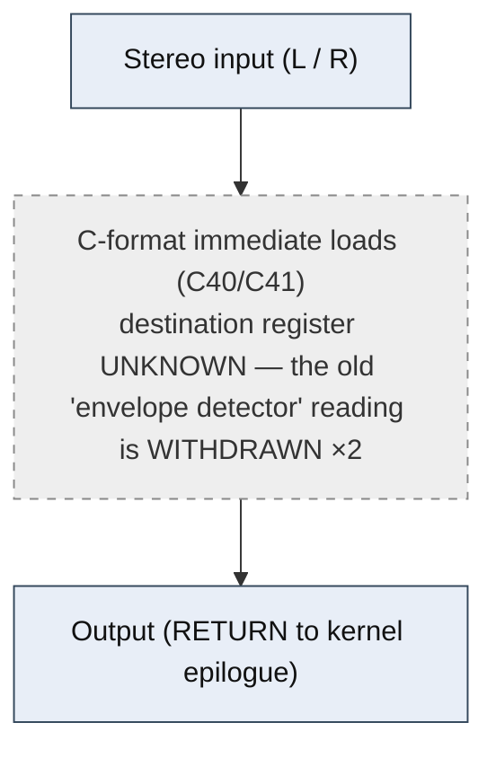

<!-- SYNCED from kn5000-roms-disasm dsp/flowcharts/prog00_no_operation.md by tools/sync_flowcharts.py -- DO NOT EDIT; run `make flowcharts`. -->

# NO OPERATION &mdash; signal-flow flowchart

<!-- GENERATED by dsp/tools/gen_dsp_flowcharts.py -- DO NOT EDIT. -->
<!-- Structure comes from the ROM words + the notes; edit those and re-run. -->

Image rep **algo 0** &middot; slots 0,7,11,12,13,14,28,29,30,31,37,38,40,41,42,43,44,45,46,47,49,51,55,61,62,63,69,76,77,78,80,81,82,83,84,85,86,87,92,93,94,95 &middot; **unit 0** (I-RAM load 84) &middot; family **dynamics** &middot; confidence **medium**.

> dry pass-through that still runs a level detector (2/pi env, one-pole smoothers); shared by 42 effect slots

**49 words**, 8 class-A coefficient multiplies (0 named), 0 instructions still opaque, **14 of 49 not yet decoded**. Landmarks detected: 1 biquad DF-I section(s), 2 C-format immediate load(s), 3 DRAM read/write word(s).

### Classic-topology match

**Most likely textbook topology:** Envelope follower + gain computer (level detector &rarr; VCA).

A rectify/smooth level detector drives a gain multiply; no delay line.

**Instruction hint:** the threshold/envelope path GATES a class-A MAC (LIVE: COMPRESSOR's SRC 0x07/ACT 0x15 store MAC does not fire every frame &mdash; the threshold conditional).

Per-instruction detail: [`../disasm/prog00_no_operation.dsm`](https://github.com/ArqueologiaDigital/kn5000-roms-disasm/blob/main/dsp/disasm/prog00_no_operation.dsm). Confidence legend and method: [`README.md`]({{ site.baseurl }}/effects-dsp/flowcharts/). Narrative: the MAME development blog, KN5000 effects-DSP series (Parts 78-84). Reference: the project docs site, `/effects-dsp/`.
