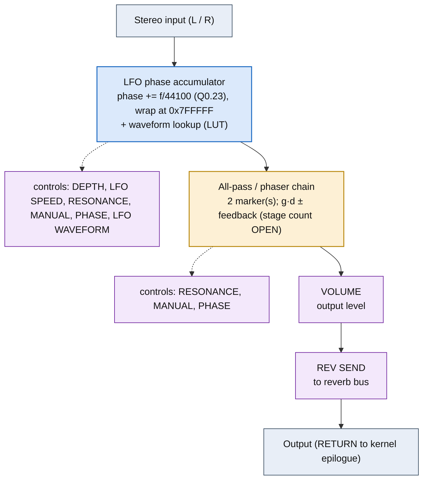

<!-- SYNCED from kn5000-roms-disasm dsp/flowcharts/prog05_phaser.md by tools/sync_flowcharts.py -- DO NOT EDIT; run `make flowcharts`. -->

# PHASER &mdash; signal-flow flowchart

<!-- GENERATED by dsp/tools/gen_dsp_flowcharts.py -- DO NOT EDIT. -->
<!-- Structure comes from the ROM words + the notes; edit those and re-run. -->

Image rep **algo 5** &middot; slots 5 &middot; **unit 0** (I-RAM load 84) &middot; family **modulation** &middot; confidence **medium**.

> phaser: LFO-swept first-order all-pass chain (~0.438 +/-0.025), 0.3 feedback

**106 words**, 14 class-A coefficient multiplies (9 named), 0 instructions still opaque, **17 of 106 not yet decoded**. Landmarks detected: 2 LFO phase word(s), 2 waveshaper LUT selector(s), 2 all-pass marker(s).

### Classic-topology match

**Most likely textbook topology:** LFO-modulated delay (chorus/flanger/ensemble) or swept all-pass chain (phaser).

An LFO phase accumulator (a D-RAM cell ramping by the LFO-SPEED each frame) modulates a short delay tap (chorus/flanger, + feedback/resonance) or sweeps an all-pass chain (phaser sweeps notches, ~0 delay-DRAM but many z&#8315;&#185; pairs).

**Instruction hint:** the LFO cell's per-frame increment IS the LFO-SPEED parameter (LIVE: CHORUS cell 0x10 ramps +114/frame, &rarr;+494 when the SPEED knob is driven); the LFO-conditional MACs are the class-A words that do NOT fire every frame (LIVE: FLANGER's SRC 0x08 coef-square, f31=4).

**UI parameters** (MEASURED, `notes/kn5000-dsp-paramlist.md`): DEPTH, LFO SPEED, RESONANCE, MANUAL, PHASE, LFO WAVEFORM, VOLUME, REV SEND.

Per-instruction detail: [`../disasm/prog05_phaser.dsm`](https://github.com/ArqueologiaDigital/kn5000-roms-disasm/blob/main/dsp/disasm/prog05_phaser.dsm). Confidence legend and method: [`README.md`]({{ site.baseurl }}/effects-dsp/flowcharts/). Narrative: the MAME development blog, KN5000 effects-DSP series (Parts 78-84). Reference: the project docs site, `/effects-dsp/`.
