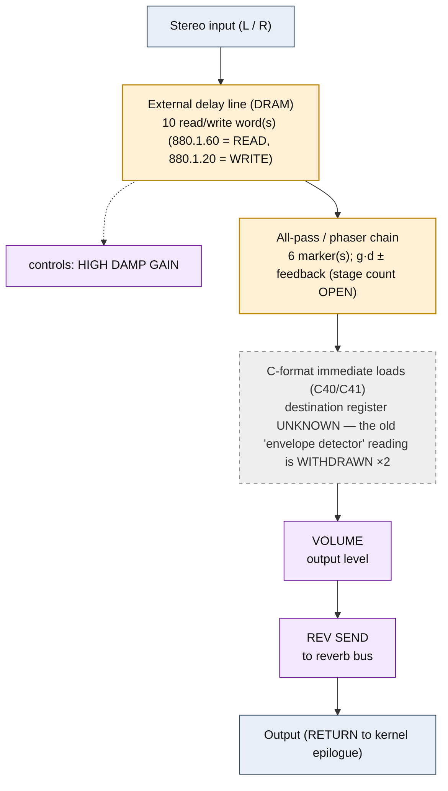

<!-- SYNCED from kn5000-roms-disasm dsp/flowcharts/prog08_gated_reverb.md by tools/sync_flowcharts.py -- DO NOT EDIT; run `make flowcharts`. -->

# GATED REVERB &mdash; signal-flow flowchart

<!-- GENERATED by dsp/tools/gen_dsp_flowcharts.py -- DO NOT EDIT. -->
<!-- Structure comes from the ROM words + the notes; edit those and re-run. -->

Image rep **algo 8** &middot; slots 8 &middot; **unit 0** (I-RAM load 84) &middot; family **reverb** &middot; confidence **medium**.

> gated reverb: all-pass ring + hold gate

**102 words**, 22 class-A coefficient multiplies (7 named), 0 instructions still opaque, **8 of 102 not yet decoded**. Landmarks detected: 2 C-format immediate load(s), 10 DRAM read/write word(s), 6 all-pass marker(s).

### Classic-topology match

**Most likely textbook topology:** All-pass diffuser ladder + comb (Schroeder/Moorer reverb tank).

A chain of all-pass sections (single coefficient/stage on the KN5000) over the external delay-DRAM &mdash; the most DRAM-heavy program; ER taps at 6000/12000/18000/24000 samples.

**Instruction hint:** the diffuser feed/feedback gains are class-A MACs on delay-read taps; the all-pass z&#8315;&#185; updates are the bqp pair (ACT 0x0D/0x0E).

**UI parameters** (MEASURED, `notes/kn5000-dsp-paramlist.md`): GATE TIME, HIGH DAMP GAIN, THRESHOLD, MASK TIME, VOLUME, REV SEND.

Per-instruction detail: [`../disasm/prog08_gated_reverb.dsm`](https://github.com/ArqueologiaDigital/kn5000-roms-disasm/blob/main/dsp/disasm/prog08_gated_reverb.dsm). Confidence legend and method: [`README.md`]({{ site.baseurl }}/effects-dsp/flowcharts/). Narrative: the MAME development blog, KN5000 effects-DSP series (Parts 78-84). Reference: the project docs site, `/effects-dsp/`.
