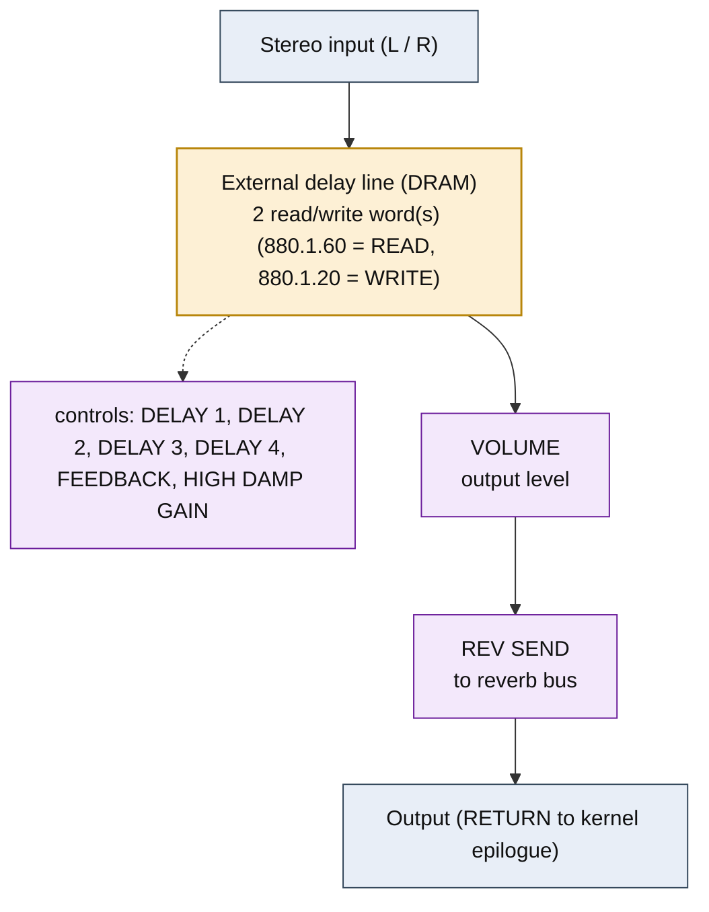

<!-- SYNCED from kn5000-roms-disasm dsp/flowcharts/prog10_multi_tap_delay.md by tools/sync_flowcharts.py -- DO NOT EDIT; run `make flowcharts`. -->

# MULTI TAP DELAY &mdash; signal-flow flowchart

<!-- GENERATED by dsp/tools/gen_dsp_flowcharts.py -- DO NOT EDIT. -->
<!-- Structure comes from the ROM words + the notes; edit those and re-run. -->

Image rep **algo 10** &middot; slots 10 &middot; **unit 0** (I-RAM load 84) &middot; family **delay** &middot; confidence **high**.

> multi-tap delay: panning taps (partial-cursor-rewind idiom, effect-map 5.1)

**68 words**, 18 class-A coefficient multiplies (11 named), 0 instructions still opaque, **4 of 68 not yet decoded**. Landmarks detected: 2 DRAM read/write word(s).

### Classic-topology match

**Most likely textbook topology:** Feedback / multi-tap delay line (Schroeder delay).

External delay-DRAM (class-1 ESCAPE word, addr8 bit 6 = write vs read) + a feedback-gain MAC; multi-tap = one write / N read taps.

**Instruction hint:** class-1 ESC words are the delay taps; delay length = READ_CELL &minus; WRITE_CELL (descriptor); feedback/mix gain = a class-A MAC on the delay-read register SRC 0x0B (LIVE: coef 0.5 = the documented 0.5 mix).

**UI parameters** (MEASURED, `notes/kn5000-dsp-paramlist.md`): DELAY 1, DELAY 2, DELAY 3, DELAY 4, PAN 1, PAN 2, PAN 3, PAN 4, FEEDBACK, HIGH DAMP GAIN, VOLUME, REV SEND.

Per-instruction detail: [`../disasm/prog10_multi_tap_delay.dsm`](https://github.com/ArqueologiaDigital/kn5000-roms-disasm/blob/main/dsp/disasm/prog10_multi_tap_delay.dsm). Confidence legend and method: [`README.md`]({{ site.baseurl }}/effects-dsp/flowcharts/). Narrative: the MAME development blog, KN5000 effects-DSP series (Parts 78-84). Reference: the project docs site, `/effects-dsp/`.
