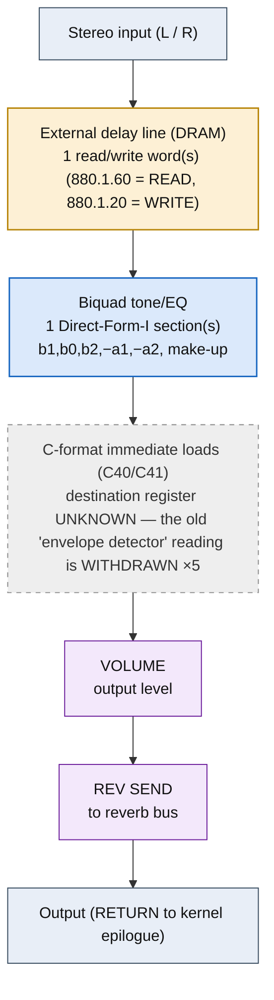

<!-- SYNCED from kn5000-roms-disasm dsp/flowcharts/prog15_rock_rotary.md by tools/sync_flowcharts.py -- DO NOT EDIT; run `make flowcharts`. -->

# ROCK ROTARY &mdash; signal-flow flowchart

<!-- GENERATED by dsp/tools/gen_dsp_flowcharts.py -- DO NOT EDIT. -->
<!-- Structure comes from the ROM words + the notes; edit those and re-run. -->

Image rep **algo 15** &middot; slots 15,53 &middot; **unit 0** (I-RAM load 84) &middot; family **rotary** &middot; confidence **high**.

> rock rotary / rotary speaker (shared with algo 53)

**86 words**, 33 class-A coefficient multiplies (6 named), 0 instructions still opaque, **19 of 86 not yet decoded**. Landmarks detected: 1 biquad DF-I section(s), 5 C-format immediate load(s), 1 DRAM read/write word(s), 1 waveshaper LUT selector(s), 2 class-8 post-sum step(s).

### Classic-topology match

**Most likely textbook topology:** LFO-swept delay (Doppler) + tone biquad (horn coloration).

A rotating-speaker model: an LFO sweeps a delay (Doppler pitch) into a tone biquad.

**Instruction hint:** LFO cell + delay-DRAM + a DF-I biquad, combined.

**UI parameters** (MEASURED, `notes/kn5000-dsp-paramlist.md`): DRIVE, VOLUME ADJUST, TREBLE DEPTH, FAST, SLOW, WIND UP, WIND DOWN, BASS DEPTH, BASS FAST, BASS SLOW, WIND UP, WIND DOWN, VOLUME, SLOW/FAST, REV SEND.

Per-instruction detail: [`../disasm/prog15_rock_rotary.dsm`](https://github.com/ArqueologiaDigital/kn5000-roms-disasm/blob/main/dsp/disasm/prog15_rock_rotary.dsm). Confidence legend and method: [`README.md`]({{ site.baseurl }}/effects-dsp/flowcharts/). Narrative: the MAME development blog, KN5000 effects-DSP series (Parts 78-84). Reference: the project docs site, `/effects-dsp/`.
