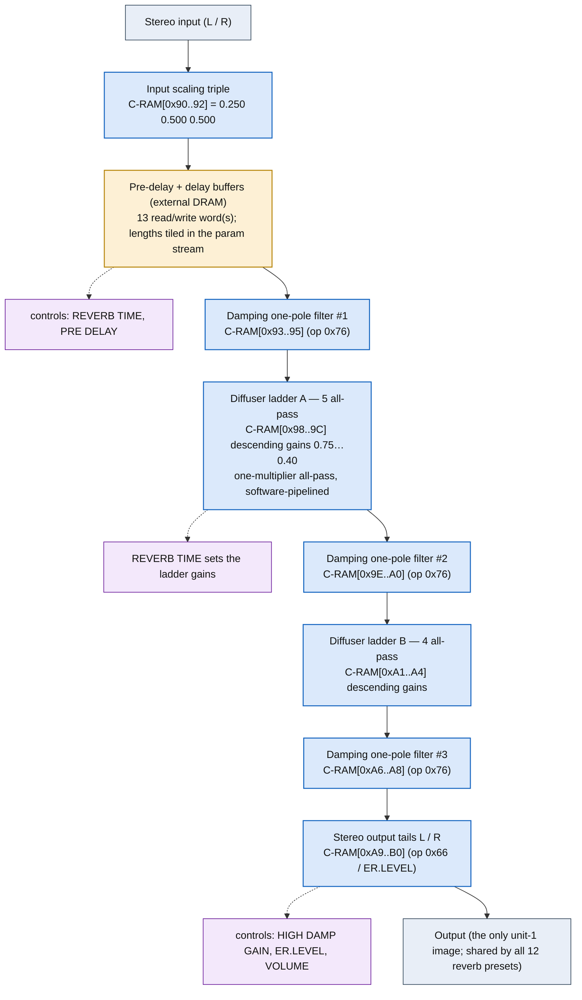

<!-- SYNCED from kn5000-roms-disasm dsp/flowcharts/prog16_room_reverb_1.md by tools/sync_flowcharts.py -- DO NOT EDIT; run `make flowcharts`. -->

# ROOM REVERB 1 &mdash; signal-flow flowchart

<!-- GENERATED by dsp/tools/gen_dsp_flowcharts.py -- DO NOT EDIT. -->
<!-- Structure comes from the ROM words + the notes; edit those and re-run. -->

Image rep **algo 16** &middot; slots 16,17,18,19,20,21,22,23,24,25,26,27 &middot; **unit 1** (I-RAM load 200) &middot; family **reverb** &middot; confidence **SOLVED**.

> reverb tank: all-pass diffuser ladders of 5 and 4 stages + damping (algorithm decoded to the bit; the per-word roles of the 6-word core are narrowed to two surviving assignments); the ONLY unit-1 image, shared by the 12 reverb presets algos 16-27

**133 words**, 33 class-A coefficient multiplies (33 named), 0 instructions still opaque, **9 of 133 not yet decoded**. Landmarks detected: 4 C-format immediate load(s), 13 DRAM read/write word(s), 9 all-pass marker(s).

### Classic-topology match

**Most likely textbook topology:** All-pass diffuser ladder + comb (Schroeder/Moorer reverb tank).

A chain of all-pass sections (single coefficient/stage on the KN5000) over the external delay-DRAM &mdash; the most DRAM-heavy program; ER taps at 6000/12000/18000/24000 samples.

**Instruction hint:** the diffuser feed/feedback gains are class-A MACs on delay-read taps; the all-pass z&#8315;&#185; updates are the bqp pair (ACT 0x0D/0x0E).

**UI parameters** (MEASURED, `notes/kn5000-dsp-paramlist.md`): REVERB TIME, PRE DELAY, HIGH DAMP GAIN, ER.LEVEL, VOLUME.

Per-instruction detail: [`../disasm/prog16_room_reverb_1.dsm`](https://github.com/ArqueologiaDigital/kn5000-roms-disasm/blob/main/dsp/disasm/prog16_room_reverb_1.dsm). Confidence legend and method: [`README.md`]({{ site.baseurl }}/effects-dsp/flowcharts/). Narrative: the MAME development blog, KN5000 effects-DSP series (Parts 78-84). Reference: the project docs site, `/effects-dsp/`.
