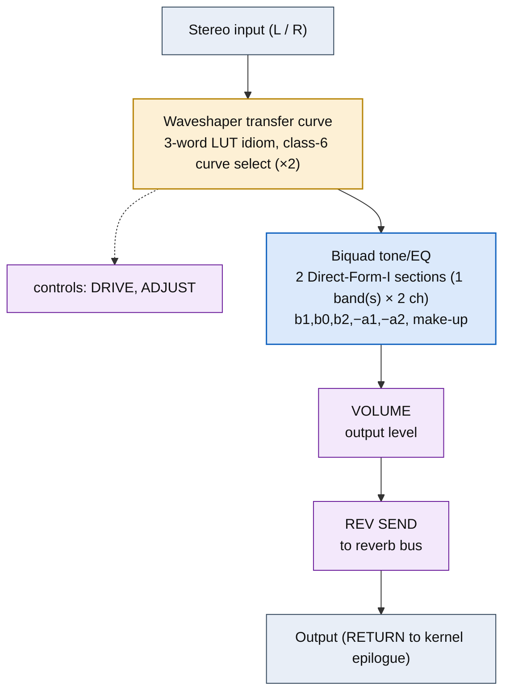

<!-- SYNCED from kn5000-roms-disasm dsp/flowcharts/prog33_overdrive.md by tools/sync_flowcharts.py -- DO NOT EDIT; run `make flowcharts`. -->

# OVERDRIVE &mdash; signal-flow flowchart

<!-- GENERATED by dsp/tools/gen_dsp_flowcharts.py -- DO NOT EDIT. -->
<!-- Structure comes from the ROM words + the notes; edit those and re-run. -->

Image rep **algo 33** &middot; slots 33 &middot; **unit 0** (I-RAM load 84) &middot; family **distortion** &middot; confidence **high**.

> overdrive: waveshaper + smoother + 4kHz Butterworth tone

**63 words**, 18 class-A coefficient multiplies (4 named), 0 instructions still opaque, **13 of 63 not yet decoded**. Landmarks detected: 2 biquad DF-I section(s), 2 waveshaper LUT selector(s), 2 class-8 post-sum step(s).

### Classic-topology match

**Most likely textbook topology:** Memoryless waveshaper (drive &rarr; nonlinearity &rarr; level) + optional tone biquad.

gain(drive) &rarr; nonlinear transfer &rarr; gain(level); OVERDRIVE/EXCITER append a DF-I tone biquad, FUZZ/DISTORTION are the bare (harder) shaper.

**Instruction hint:** the nonlinearity is a class-6 table lookup (addr8 0x28 = table selector). The class-6 idiom reads a table FROM C-RAM (index in m_tb); it is NOT undumped &mdash; C-RAM is populated entirely from dumped ROM (per-preset parameter streams + the boot blob at Sub CPU ROM 0x01E6BE). PROVEN for the identical idiom's LFO-waveform role: that table is a 24-entry sine UPLOADED BY THE HOST, matching 0.95&middot;2^23&middot;sin(2&pi;k/24+0.1) to 1 LSB &mdash; no internal silicon ROM is in the class-6 path. (Open DECODE, not missing data: which exact C-RAM cells hold the waveshaper table and the index arithmetic.) Present in OVERDRIVE, FUZZ and DISTORTION alike. The ACT 0x12/0x13/0x14 cluster, LIVE only in OVERDRIVE and ABSENT from FUZZ, is the post tone BIQUAD (its coeffs [0.019, 0.609, &minus;0.448, 0.750] sit in biquad range, e.g. &minus;a2&asymp;0.448 for a 4 kHz low-pass); it is NOT a polynomial waveshaper (an earlier reading, now retracted &mdash; the same cluster is the DF-I biquad state ops 0x13=ld.ta / 0x14=mac.tb).

**UI parameters** (MEASURED, `notes/kn5000-dsp-paramlist.md`): DRIVE, ADJUST, VOLUME, REV SEND.

Per-instruction detail: [`../disasm/prog33_overdrive.dsm`](https://github.com/ArqueologiaDigital/kn5000-roms-disasm/blob/main/dsp/disasm/prog33_overdrive.dsm). Confidence legend and method: [`README.md`]({{ site.baseurl }}/effects-dsp/flowcharts/). Narrative: the MAME development blog, KN5000 effects-DSP series (Parts 78-84). Reference: the project docs site, `/effects-dsp/`.
