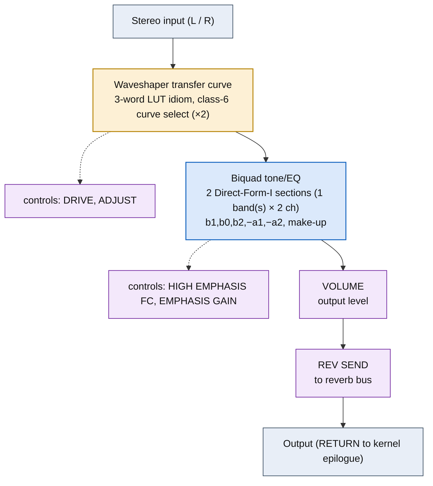

<!-- SYNCED from kn5000-roms-disasm dsp/flowcharts/prog35_exciter.md by tools/sync_flowcharts.py -- DO NOT EDIT; run `make flowcharts`. -->

# EXCITER &mdash; signal-flow flowchart

<!-- GENERATED by dsp/tools/gen_dsp_flowcharts.py -- DO NOT EDIT. -->
<!-- Structure comes from the ROM words + the notes; edit those and re-run. -->

Image rep **algo 35** &middot; slots 35 &middot; **unit 0** (I-RAM load 84) &middot; family **exciter** &middot; confidence **high**.

> harmonic exciter: LUT -> band-pass -> +dry

**69 words**, 22 class-A coefficient multiplies (18 named), 0 instructions still opaque, **15 of 69 not yet decoded**. Landmarks detected: 2 biquad DF-I section(s), 2 waveshaper LUT selector(s), 2 class-8 post-sum step(s).

### Classic-topology match

**Most likely textbook topology:** Harmonic exciter = high-band waveshaper + tone biquad.

A waveshaper generates upper harmonics, then a DF-I tone biquad shapes them.

**Instruction hint:** same waveshaper + DF-I-biquad idioms as distortion.

**UI parameters** (MEASURED, `notes/kn5000-dsp-paramlist.md`): DRIVE, ADJUST, HIGH EMPHASIS FC, EMPHASIS GAIN, VOLUME, REV SEND.

Per-instruction detail: [`../disasm/prog35_exciter.dsm`](https://github.com/ArqueologiaDigital/kn5000-roms-disasm/blob/main/dsp/disasm/prog35_exciter.dsm). Confidence legend and method: [`README.md`]({{ site.baseurl }}/effects-dsp/flowcharts/). Narrative: the MAME development blog, KN5000 effects-DSP series (Parts 78-84). Reference: the project docs site, `/effects-dsp/`.
