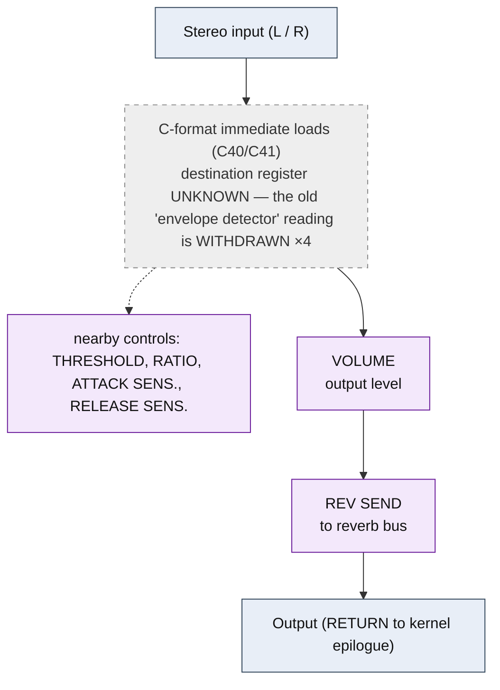

<!-- SYNCED from kn5000-roms-disasm dsp/flowcharts/prog36_compressor.md by tools/sync_flowcharts.py -- DO NOT EDIT; run `make flowcharts`. -->

# COMPRESSOR &mdash; signal-flow flowchart

<!-- GENERATED by dsp/tools/gen_dsp_flowcharts.py -- DO NOT EDIT. -->
<!-- Structure comes from the ROM words + the notes; edit those and re-run. -->

Image rep **algo 36** &middot; slots 36 &middot; **unit 0** (I-RAM load 84) &middot; family **dynamics** &middot; confidence **medium**.

> compressor: level detector + gain-computer (THRESHOLD/RATIO).  NOTE: the old 'hi12=0xC40 = envelope detector' reading is WITHDRAWN -- C40/C41 is a 13-bit immediate load (analysis/k5-output-stage.md); the detector is here on other grounds

**40 words**, 10 class-A coefficient multiplies (1 named), 0 instructions still opaque, **14 of 40 not yet decoded**. Landmarks detected: 4 C-format immediate load(s).

### Classic-topology match

**Most likely textbook topology:** Envelope follower + gain computer (level detector &rarr; VCA).

A rectify/smooth level detector drives a gain multiply; no delay line.

**Instruction hint:** the threshold/envelope path GATES a class-A MAC (LIVE: COMPRESSOR's SRC 0x07/ACT 0x15 store MAC does not fire every frame &mdash; the threshold conditional).

**UI parameters** (MEASURED, `notes/kn5000-dsp-paramlist.md`): THRESHOLD, RATIO, ATTACK SENS., RELEASE SENS., VOLUME, REV SEND.

Per-instruction detail: [`../disasm/prog36_compressor.dsm`](https://github.com/ArqueologiaDigital/kn5000-roms-disasm/blob/main/dsp/disasm/prog36_compressor.dsm). Confidence legend and method: [`README.md`]({{ site.baseurl }}/effects-dsp/flowcharts/). Narrative: the MAME development blog, KN5000 effects-DSP series (Parts 78-84). Reference: the project docs site, `/effects-dsp/`.
