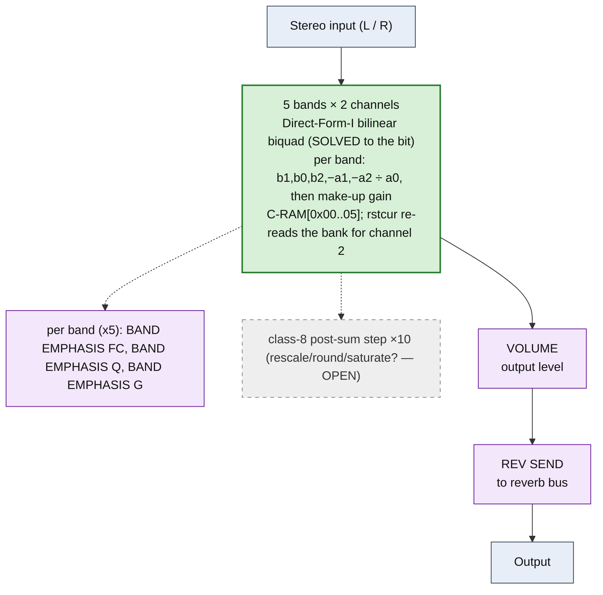

<!-- SYNCED from kn5000-roms-disasm dsp/flowcharts/prog39_parametric_eq.md by tools/sync_flowcharts.py -- DO NOT EDIT; run `make flowcharts`. -->

# PARAMETRIC EQ &mdash; signal-flow flowchart

<!-- GENERATED by dsp/tools/gen_dsp_flowcharts.py -- DO NOT EDIT. -->
<!-- Structure comes from the ROM words + the notes; edit those and re-run. -->

Image rep **algo 39** &middot; slots 39 &middot; **unit 0** (I-RAM load 84) &middot; family **eq** &middot; confidence **SOLVED**.

> parametric EQ: 5 bands x 2 channels, Direct-Form-I bilinear biquad (decoded to the bit); the reference program

**105 words**, 60 class-A coefficient multiplies (60 named), 0 instructions still opaque, **4 of 105 not yet decoded**. Landmarks detected: 10 biquad DF-I section(s), 10 class-8 post-sum step(s).

### Classic-topology match

**Most likely textbook topology:** Cascaded Direct-Form-I biquads (2nd-order sections in series).

Each band = one 9-word DF-I section `ld.ta(0x13) · mac(0x12) · mac · mac.tb(0x14) · mac · mac.st tb · class-8 post · mac.st(makeup) · ld.st ta`; two z&#8315;&#185; state latches tempA/tempB; coefficients b1,b0,b2,&minus;a1,&minus;a2,makeup.

**Instruction hint:** ACT 0x13 = load state tempA, 0x12 = MAC, 0x14 = MAC+store tempB; **tempA/tempB ARE the biquad z&#8315;&#185; states**. This is the ISA reference program.

**UI parameters** (MEASURED, `notes/kn5000-dsp-paramlist.md`): (BAND EMPHASIS FC, BAND EMPHASIS Q, BAND EMPHASIS G) x5, VOLUME, REV SEND.

Per-instruction detail: [`../disasm/prog39_parametric_eq.dsm`](https://github.com/ArqueologiaDigital/kn5000-roms-disasm/blob/main/dsp/disasm/prog39_parametric_eq.dsm). Confidence legend and method: [`README.md`]({{ site.baseurl }}/effects-dsp/flowcharts/). Narrative: the MAME development blog, KN5000 effects-DSP series (Parts 78-84). Reference: the project docs site, `/effects-dsp/`.
