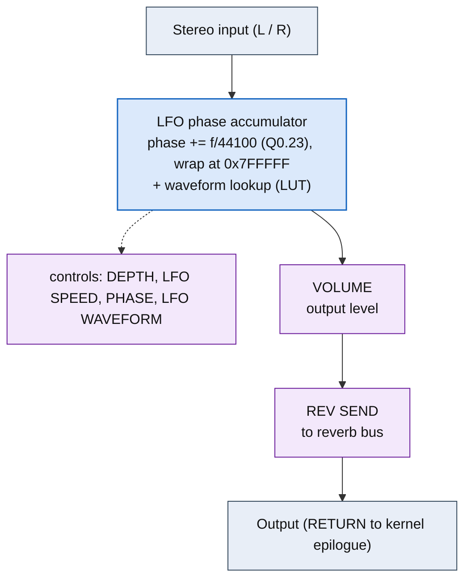

<!-- SYNCED from kn5000-roms-disasm dsp/flowcharts/prog48_auto_pan.md by tools/sync_flowcharts.py -- DO NOT EDIT; run `make flowcharts`. -->

# AUTO PAN &mdash; signal-flow flowchart

<!-- GENERATED by dsp/tools/gen_dsp_flowcharts.py -- DO NOT EDIT. -->
<!-- Structure comes from the ROM words + the notes; edit those and re-run. -->

Image rep **algo 48** &middot; slots 48 &middot; **unit 0** (I-RAM load 84) &middot; family **am** &middot; confidence **high**.

> auto pan: quadrature LFO amplitude panner

**50 words**, 8 class-A coefficient multiplies (2 named), 0 instructions still opaque, **19 of 50 not yet decoded**. Landmarks detected: 2 LFO phase word(s), 2 waveshaper LUT selector(s).

### Classic-topology match

**Most likely textbook topology:** Amplitude / carrier modulation (auto-pan L/R gain, ring-mod carrier&times;signal, vibrato).

An LFO or carrier multiplies the signal: auto-pan = LFO&rarr;L/R gains; ring-mod = table carrier &times; signal; vibrato = LFO&rarr;delay/pitch.

**Instruction hint:** the modulating multiply is a class-A MAC whose operand is the LFO/carrier cell; ring-mod adds a class-6 table (the carrier).

**UI parameters** (MEASURED, `notes/kn5000-dsp-paramlist.md`): DEPTH, LFO SPEED, PHASE, LFO WAVEFORM, VOLUME, REV SEND.

Per-instruction detail: [`../disasm/prog48_auto_pan.dsm`](https://github.com/ArqueologiaDigital/kn5000-roms-disasm/blob/main/dsp/disasm/prog48_auto_pan.dsm). Confidence legend and method: [`README.md`]({{ site.baseurl }}/effects-dsp/flowcharts/). Narrative: the MAME development blog, KN5000 effects-DSP series (Parts 78-84). Reference: the project docs site, `/effects-dsp/`.
