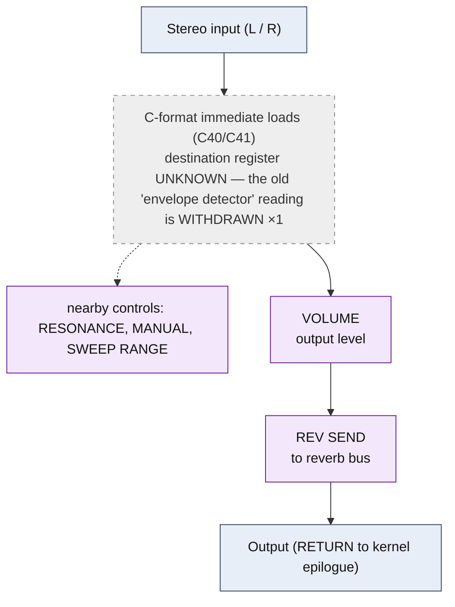

<!-- SYNCED from kn5000-roms-disasm dsp/flowcharts/prog52_auto_wah.md by tools/sync_flowcharts.py -- DO NOT EDIT; run `make flowcharts`. -->

# AUTO WAH &mdash; signal-flow flowchart

<!-- GENERATED by dsp/tools/gen_dsp_flowcharts.py -- DO NOT EDIT. -->
<!-- Structure comes from the ROM words + the notes; edit those and re-run. -->

Image rep **algo 52** &middot; slots 52 &middot; **unit 0** (I-RAM load 84) &middot; family **filter** &middot; confidence **medium**.

> auto wah: envelope-swept resonator

**72 words**, 13 class-A coefficient multiplies (6 named), 0 instructions still opaque, **11 of 72 not yet decoded**. Landmarks detected: 1 C-format immediate load(s), 2 class-8 post-sum step(s).

### Classic-topology match

**Most likely textbook topology:** Swept state-variable / DF-I biquad (enhancer, auto-wah).

A biquad whose cutoff is swept by an LFO or an envelope (auto-wah).

**Instruction hint:** the same DF-I biquad idiom as EQ, with the cutoff coefficient updated from the LFO/envelope cell.

**UI parameters** (MEASURED, `notes/kn5000-dsp-paramlist.md`): RESONANCE, MANUAL, SWEEP RANGE, VOLUME, REV SEND.

Per-instruction detail: [`../disasm/prog52_auto_wah.dsm`](https://github.com/ArqueologiaDigital/kn5000-roms-disasm/blob/main/dsp/disasm/prog52_auto_wah.dsm). Confidence legend and method: [`README.md`]({{ site.baseurl }}/effects-dsp/flowcharts/). Narrative: the MAME development blog, KN5000 effects-DSP series (Parts 78-84). Reference: the project docs site, `/effects-dsp/`.
