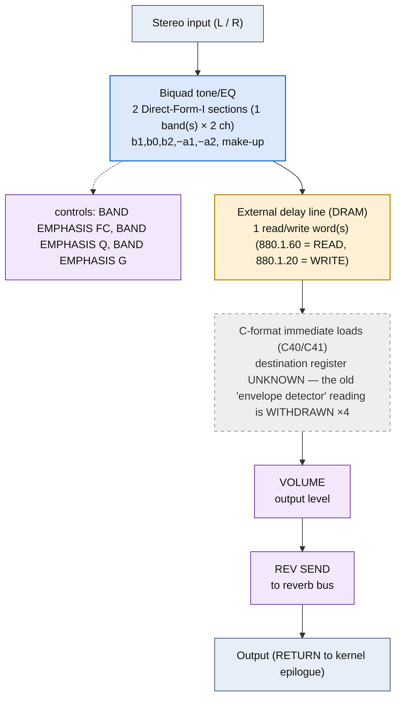

<!-- SYNCED from kn5000-roms-disasm dsp/flowcharts/prog75_peq_compressor.md by tools/sync_flowcharts.py -- DO NOT EDIT; run `make flowcharts`. -->

# PEQ+COMPRESSOR &mdash; signal-flow flowchart

<!-- GENERATED by dsp/tools/gen_dsp_flowcharts.py -- DO NOT EDIT. -->
<!-- Structure comes from the ROM words + the notes; edit those and re-run. -->

Image rep **algo 75** &middot; slots 75 &middot; **unit 0** (I-RAM load 84) &middot; family **combi** &middot; confidence **high**.

> 1-band flat PEQ + compressor (+4 cursor/host offset, effect-map 5.2)

**59 words**, 22 class-A coefficient multiplies (13 named), 0 instructions still opaque, **14 of 59 not yet decoded**. Landmarks detected: 2 biquad DF-I section(s), 4 C-format immediate load(s), 1 DRAM read/write word(s), 2 class-8 post-sum step(s).

### Classic-topology match

**Most likely textbook topology:** Union of the sub-effect topologies, in name order.

E.g. PEQ+DIST+DELAY = DF-I biquad(s) &rarr; waveshaper &rarr; delay line; the shape is the concatenation of the named stages.

**Instruction hint:** each named stage contributes its own idiom (biquad ACT 0x12/13/14, waveshaper class-6 LUT, delay class-1 ESC, LFO cell).

**UI parameters** (MEASURED, `notes/kn5000-dsp-paramlist.md`): BAND EMPHASIS FC, BAND EMPHASIS Q, BAND EMPHASIS G, THRESHOLD, RATIO, ATTACK SENS., RELEASE SENS., VOLUME, REV SEND.

Per-instruction detail: [`../disasm/prog75_peq_compressor.dsm`](https://github.com/ArqueologiaDigital/kn5000-roms-disasm/blob/main/dsp/disasm/prog75_peq_compressor.dsm). Confidence legend and method: [`README.md`]({{ site.baseurl }}/effects-dsp/flowcharts/). Narrative: the MAME development blog, KN5000 effects-DSP series (Parts 78-84). Reference: the project docs site, `/effects-dsp/`.
